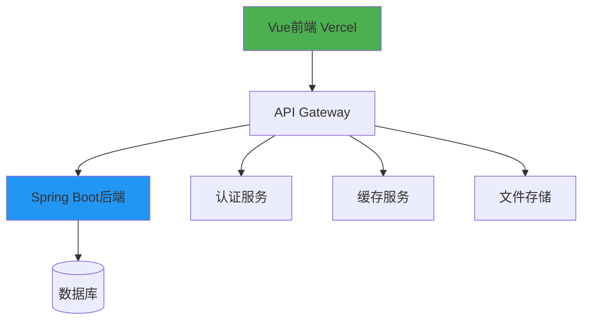

# 就业画像网站 MVP 版本需求文档

## 1. 项目概述

基于简约像素风格的就业画像网站，主要服务于教育就业领域，包含四种身份角色：管理员、考官（教师）、州牧（企业）和监生（学生）。

## 2. 技术栈

- 前端：Vue.js
- 后端：
  - 生产环境：Spring Framework
  - 开发环境：Supabase
- AI集成：n8n
- 部署平台：Vercel

## 3. 角色与功能需求

### 3.1 管理员

**核心功能**：
- 生成企业密钥【请帖】（用于创建州牧账号）
- 生成考官密钥【升官】（用于创建考官账号）
- 不能自主创建管理员账号

**界面需求**：
- 密钥生成面板（简约像素风格）
- 已生成密钥列表（带有效期显示）
- 密钥使用情况统计

### 3.2 考官（教师）

**核心功能**：
- 为关联学生分配初始能力点数（10点）
- 发布小任务到【布告栏】
- 评审学生完成的任务并分配额外点数（4点/任务）
- 生成教师keys用于学生关联
- 不能自主创建考官账号

**界面需求**：
- 学生管理面板（像素风格能力条）
- 布告栏发布界面
- 任务评审面板
- 教师keys生成与管理

### 3.3 州牧（企业）

**核心功能**：
- 拥有初始点数用于匹配学生
- 查看和描述匹配学生
- 不能自主创建州牧账号

**界面需求**：
- 企业信息管理
- 学生匹配面板
- 点数使用情况显示

### 3.4 监生（学生）

**核心功能**：
- 初始拥有10点能力点数
- 两种状态：在野/中举
- 未关联教师时可自由调整能力条（不存储）
- 查看推荐考官及其布告栏
- 通过教师keys关联考官后：
  - 能力条调整权限转交给考官
  - 可接取关联考官发布的任务

**界面需求**：
- 个人信息面板（像素风格）
- 能力条调整界面
- 教师keys输入框
- 布告栏浏览界面
- 任务接取与提交面板

## 4. 数据模型（关键字段）

### 用户表
- id: 唯一标识
- username: 用户名
- password: 加密密码
- role: 角色（admin/examiner/enterprise/student）
- status: 状态（对学生为在野/中举）
- created_at: 创建时间

### 密钥表
- id: 唯一标识
- key: 密钥内容
- type: 类型（请帖/升官/教师key）
- creator_id: 创建者ID
- used: 是否已使用
- used_by: 使用者ID（如已使用）
- expires_at: 过期时间

### 能力表（存储当前有效的能力值总和）
- user_id: 用户ID（主键）
- frontend_points: 前端能力点数（0-10）
- android_points: 安卓能力点数（0-10）
- backend_points: 后端能力点数（0-10）
- ai_points: AI能力点数（0-10）
- communication_points: 沟通力点数（0-10）
- creativity_points: 创造力点数（0-10）
- leadership_points: 领导力点数（0-10）
- updated_at: 最后更新时间

### 能力值记录表（支持过期设定的核心表）
- id: 唯一标识
- user_id: 用户ID
- ability_type: 能力类型（frontend/android/backend/ai/communication/creativity/leadership）
- points: 获得的能力点数（1-10）
- source_type: 来源类型（initial/task_reward/teacher_assigned/enterprise_match）
- source_id: 来源ID（关联任务、教师或企业）
- obtained_at: 获得时间
- expires_at: 过期时间（NULL表示永久有效）
- is_active: 是否有效（true/false）
- created_at: 记录创建时间

### 精通记录表
- id: 唯一标识
- user_id: 用户ID
- ability_type: 能力类型（frontend/android/backend）
- mastery_name: 精通名称
- mastery_time: 精通获得时间
- expires_at: 精通过期时间
- is_active: 是否有效（true/false）
- created_at: 记录创建时间

### 能力值过期机制说明

#### 能力值来源类型定义
1. **initial** - 初始能力值（永久有效）
2. **task_reward** - 任务奖励（可设置过期时间）
3. **teacher_assigned** - 教师分配（可设置过期时间）
4. **enterprise_match** - 企业匹配奖励（可设置过期时间）

#### 过期时间规则
- **初始能力值**：永久有效（expires_at = NULL）
- **任务奖励**：默认3个月过期
- **教师分配**：教师可自定义过期时间（1-12个月）
- **企业匹配**：默认6个月过期

#### 能力值计算逻辑
```sql
-- 计算用户当前有效能力值的SQL示例
SELECT 
  user_id,
  ability_type,
  SUM(points) as total_points
FROM ability_records 
WHERE user_id = ? 
  AND is_active = TRUE 
  AND (expires_at IS NULL OR expires_at > NOW())
GROUP BY user_id, ability_type
```

### 能力精通机制说明

**7大能力定义**：
1. **前端** - JavaScript、Vue、React、TypeScript
2. **安卓** - Kotlin编程语言、Android Jetpack组件、Flutter跨平台开发框架、MVVM架构模式
3. **后端** - SpringBoot、Python、C++
4. **AI** - 不需要教师进行方向特化
5. **沟通力** - 不需要精通
6. **创造力** - 不需要精通
7. **领导力** - 不需要精通

**精通触发条件**：
- 仅前端、安卓、后端三个能力支持精通机制
- 当能力值达到10点阈值时，教师可为学生选择精通方向
- 精通后对应能力点数清零，获得限时3个月的精通状态

**精通选项**：
- **前端精通**：
  - Vue专家
  - React大师
  - TypeScript高手
  - 全栈前端工程师

- **安卓精通**：
  - Kotlin专家
  - Android Jetpack大师
  - Flutter跨平台专家
  - MVVM架构师

- **后端精通**：
  - SpringBoot专家
  - Python高手
  - C++大师
  - 微服务架构师

**精通机制规则**：
1. 精通状态持续3个月，到期后自动失效
2. 重复选择相同精通会刷新过期时间
3. 精通期间显示对应的荣誉动画
4. 同一时间可以拥有多个不同的精通状态（前端、安卓、后端可同时精通）
5. 同一能力的精通状态不能重复（如不能同时拥有两个前端精通）
6. 精通失效后，学生可重新积累能力点数

### 任务表
- id: 唯一标识
- examiner_id: 发布考官ID
- title: 任务标题
- description: 任务描述
- points: 奖励点数
- deadline: 截止时间
- status: 状态（开放/进行中/已完成）

### 任务接取表
- task_id: 任务ID
- student_id: 学生ID
- status: 状态（进行中/提交待审/已完成）
- submission: 提交内容
- submitted_at: 提交时间
- reviewed_at: 评审时间

## 5. API端点规划

### 认证相关
- POST /api/auth/login - 用户登录
- POST /api/auth/register - 用户注册（仅限学生）
- POST /api/auth/upgrade - 使用密钥升级账户

### 管理员专属
- POST /api/admin/generate-key - 生成密钥
- GET /api/admin/keys - 获取密钥列表

### 考官专属
- POST /api/examiner/tasks - 发布任务
- GET /api/examiner/students - 获取关联学生列表
- POST /api/examiner/abilities - 分配学生能力点数（支持过期时间设置）
- GET /api/examiner/ability-records - 获取学生能力值记录历史
- PUT /api/examiner/ability-records/{id} - 修改能力值记录的过期时间
- POST /api/examiner/review - 评审学生任务
- POST /api/examiner/generate-key - 生成教师key
- POST /api/examiner/mastery - 为学生设置精通（仅限前端、安卓、后端能力达到10点时）
- GET /api/examiner/masteries - 获取学生的精通记录

### 州牧专属
- GET /api/enterprise/students - 获取匹配学生列表
- POST /api/enterprise/match - 匹配学生

### 监生专属
- GET /api/student/abilities - 获取当前有效能力点数
- GET /api/student/ability-records - 获取能力值记录历史（含过期信息）
- POST /api/student/abilities - 更新能力点数（仅限在野状态）
- POST /api/student/link - 关联教师
- GET /api/student/tasks - 获取可接取任务
- POST /api/student/tasks - 接取/提交任务
- GET /api/student/masteries - 获取当前精通状态和荣誉动画信息

### 系统管理
- POST /api/system/cleanup-expired-abilities - 清理过期能力值（定时任务）
- GET /api/system/ability-stats - 获取能力值统计信息

## 6. 界面设计要点（前端已大致实现）

1. **整体风格**：
   - 现代简约风格，天蓝色、米色、白色为主色调
   - 容器悬浮设计，无边框，有阴影等动态效果
   - 圆角设计，渐变背景

2. **关键组件**：
   - 悬浮式能力条（可拖动，带阴影效果）
   - 悬浮式布告栏（卡片式设计）
   - 悬浮式密钥输入框（现代简约风格）
   - 状态指示灯（悬浮式设计，在野/中举状态）
   - 精通状态显示面板（悬浮卡片，支持同时显示多个精通类型和剩余时间）
   - 荣誉动画区域（悬浮式特效展示区）

3. **动效**：
   - 能力条调整时的平滑动画
   - 任务接取/完成时的悬浮特效
   - 状态切换时的淡入淡出动画
   - 精通激活时的荣誉动画（限时3个月显示，支持多个精通同时展示）
   - 精通即将到期的提醒动画
   - 精通刷新时的悬浮特效
   - 多个精通状态叠加时的协调动画

## 7. 开发与部署计划

### 开发阶段
1. 搭建基础框架（1周）
2. 实现核心身份系统（2周）
3. 开发各角色核心功能（3周）
4. 实现像素风格UI（2周）
5. 集成测试（1周）

### 部署计划
- 开发环境：使用Supabase后端，部署在Vercel
- 生产环境：迁移至Spring后端，保持Vercel前端部署
- AI集成：通过n8n实现简单的推荐和匹配逻辑

## 8. MVP验收标准

1. 四种身份角色能正确创建和升级
2. 能力点数系统正常工作（7大能力：前端、后端、安卓、AI、沟通力、创造力、领导力）
3. 任务发布、接取和评审流程完整
4. 教师keys关联机制有效
5. 现代简约UI风格已实现（天蓝色、米色、白色为主，容器悬浮设计）
6. 基础的通知系统工作正常
7. 精通机制正常工作（前端、安卓、后端能力达到10点时可选择精通）
8. 精通状态显示和荣誉动画正常展示
9. 精通时间限制（3个月）和刷新机制有效

## 9. 后续扩展方向

1. 增加更多能力维度
2. 实现企业-学生双向匹配
3. 添加成就系统
4. 引入社交元素（学生间比较）
5. 开发移动端应用
6. 增强AI推荐算法

## 10. 风险与应对

1. **密钥滥用风险**：
   - 实现密钥有效期
   - 添加使用次数限制

2. **点数平衡问题**：
   - 初期严格限制点数分配
   - 预留后期调整空间

3. **UI性能问题**：
   - 优化像素动画性能
   - 实现懒加载

4. **数据安全**：
   - 实施严格的角色权限控制
   - 敏感操作需二次验证

## 11. 后端技术选型与实施建议

### 11.1 技术选型分析

#### 方案A：Supabase（推荐用于快速开发和中小型项目）

**优势：**
- ✅ **快速部署**：无需管理服务器，开箱即用
- ✅ **内置功能**：认证、数据库、存储、实时功能一体化
- ✅ **成本效益**：免费额度充足，适合初创项目
- ✅ **Vercel集成**：完美配合，无跨域问题
- ✅ **开发效率**：前端直接调用，减少后端开发时间

**劣势：**
- ❌ **供应商锁定**：迁移成本较高
- ❌ **定制限制**：复杂业务逻辑可能受限
- ❌ **成本增长**：随着用户量增加，成本可能上升

#### 方案B：Spring Boot本地后端（推荐用于大型企业级项目）

**优势：**
- ✅ **完全控制**：业务逻辑完全自定义
- ✅ **技术栈统一**：Java生态成熟稳定
- ✅ **性能优化**：可根据需求深度优化
- ✅ **数据安全**：数据完全自主控制
- ✅ **扩展性强**：微服务架构支持良好

**劣势：**
- ❌ **部署复杂**：需要管理服务器和数据库
- ❌ **开发周期长**：前后端分离开发工作量增加
- ❌ **运维成本**：需要专业运维团队

### 11.2 推荐实施策略

#### 短期方案：Supabase快速上线
- **目标**：快速验证产品，降低初期开发成本
- **时间**：1-2个月完成MVP版本
- **重点**：专注于前端用户体验优化

#### 长期方案：Spring Boot微服务迁移
- **目标**：业务复杂度增加时平滑迁移
- **策略**：渐进式迁移，保持API接口兼容性
- **架构**：微服务架构，支持水平扩展

### 11.3 Vercel + Spring Boot交互架构



#### 跨域配置（CORS）
```java
@Configuration
public class CorsConfig {
    @Bean
    public WebMvcConfigurer corsConfigurer() {
        return new WebMvcConfigurer() {
            @Override
            public void addCorsMappings(CorsRegistry registry) {
                registry.addMapping("/api/**")
                    .allowedOrigins("https://your-vercel-app.vercel.app")
                    .allowedMethods("GET", "POST", "PUT", "DELETE")
                    .allowCredentials(true);
            }
        };
    }
}
```

#### 前端API调用封装
```typescript
// src/services/api.ts
import axios from 'axios'

const api = axios.create({
  baseURL: import.meta.env.VITE_API_BASE_URL,
  timeout: 10000,
  withCredentials: true
})

// 请求拦截器
api.interceptors.request.use(config => {
  const token = localStorage.getItem('token')
  if (token) {
    config.headers.Authorization = `Bearer ${token}`
  }
  return config
})

// 响应拦截器
api.interceptors.response.use(
  response => response,
  error => {
    if (error.response?.status === 401) {
      // 处理认证失败
      localStorage.removeItem('token')
      window.location.href = '/login'
    }
    return Promise.reject(error)
  }
)
```

### 11.4 部署架构建议

#### 方案A：云服务器部署
- **前端**：Vercel
- **后端**：阿里云/腾讯云ECS + 负载均衡
- **数据库**：云数据库RDS
- **存储**：对象存储OSS

#### 方案B：容器化部署
- **前端**：Vercel
- **后端**：Docker + 云容器服务
- **数据库**：云数据库
- **网关**：API网关服务

### 11.5 实施路线图

#### 第一阶段（1-2个月）：Supabase MVP
- [ ] 完成前端基础功能开发
- [ ] 集成Supabase后端服务
- [ ] 实现基础认证和权限控制
- [ ] 部署到Vercel进行测试

#### 第二阶段（3-4个月）：数据模型优化
- [ ] 完善数据模型设计
- [ ] 优化API接口设计
- [ ] 保持与Spring Boot兼容的数据结构
- [ ] 建立监控和日志体系

#### 第三阶段（5-6个月）：Spring Boot迁移准备
- [ ] 搭建Spring Boot基础框架
- [ ] 实现核心业务逻辑
- [ ] 建立API兼容性测试
- [ ] 制定数据迁移方案

#### 第四阶段（7-8个月）：正式迁移
- [ ] 并行运行双后端系统
- [ ] 逐步迁移用户数据
- [ ] 性能测试和优化
- [ ] 正式切换后端服务

### 11.6 关键成功因素

1. **API抽象层**：封装API调用，便于后期切换
2. **数据兼容性**：保持数据模型与未来Spring Boot兼容
3. **监控体系**：提前规划日志和监控体系
4. **安全策略**：统一认证和授权机制
5. **性能基准**：建立性能基准测试

### 11.7 风险评估与应对

| 风险类型 | 影响程度 | 应对措施 |
|---------|---------|---------|
| 供应商锁定 | 高 | 保持API抽象，预留迁移路径 |
| 数据迁移风险 | 中 | 制定详细迁移计划，并行运行 |
| 性能问题 | 中 | 建立性能监控，定期优化 |
| 安全漏洞 | 高 | 实施安全审计，定期更新 |

通过以上实施建议，可以确保项目在快速上线和长期发展之间找到平衡点，为未来的扩展和优化奠定坚实基础。

## 12. 能力值过期机制的业务逻辑

### 12.1 能力值计算流程

```typescript
// 计算用户当前有效能力值的业务逻辑
async function calculateCurrentAbilities(userId: number) {
  const records = await AbilityRecord.findAll({
    where: {
      user_id: userId,
      is_active: true,
      [Op.or]: [
        { expires_at: null }, // 永久有效
        { expires_at: { [Op.gt]: new Date() } } // 未过期
      ]
    }
  });

  const abilities = {
    frontend_points: 0,
    android_points: 0,
    backend_points: 0,
    ai_points: 0,
    communication_points: 0,
    creativity_points: 0,
    leadership_points: 0
  };

  records.forEach(record => {
    abilities[`${record.ability_type}_points`] += record.points;
  });

  // 确保每个能力值不超过10点
  Object.keys(abilities).forEach(key => {
    abilities[key] = Math.min(abilities[key], 10);
  });

  return abilities;
}
```

### 12.2 API请求/响应示例

#### 教师分配能力值（支持过期时间）
```http
POST /api/examiner/abilities
Content-Type: application/json
Authorization: Bearer {token}

{
  "student_id": 123,
  "ability_type": "frontend",
  "points": 3,
  "expires_in_months": 6  // 可选，默认3个月
}
```

响应：
```json
{
  "success": true,
  "record_id": 456,
  "expires_at": "2024-04-21T10:00:00Z",
  "current_abilities": {
    "frontend_points": 8,
    "android_points": 5,
    "backend_points": 3,
    "ai_points": 2,
    "communication_points": 4,
    "creativity_points": 3,
    "leadership_points": 2
  }
}
```

#### 获取能力值记录历史
```http
GET /api/student/ability-records
Authorization: Bearer {token}
```

响应：
```json
{
  "records": [
    {
      "id": 456,
      "ability_type": "frontend",
      "points": 3,
      "source_type": "teacher_assigned",
      "source_description": "教师张三分配",
      "obtained_at": "2024-01-21T10:00:00Z",
      "expires_at": "2024-04-21T10:00:00Z",
      "days_remaining": 89,
      "is_active": true
    },
    {
      "id": 123,
      "ability_type": "frontend",
      "points": 5,
      "source_type": "initial",
      "source_description": "初始能力值",
      "obtained_at": "2024-01-15T08:30:00Z",
      "expires_at": null,
      "days_remaining": null,
      "is_active": true
    }
  ],
  "current_totals": {
    "frontend_points": 8,
    "android_points": 5,
    "backend_points": 3
  }
}
```

### 12.3 定时任务设计

#### 清理过期能力值的定时任务
```typescript
// 每天凌晨执行，清理过期能力值
async function cleanupExpiredAbilities() {
  const expiredRecords = await AbilityRecord.update(
    { is_active: false },
    {
      where: {
        is_active: true,
        expires_at: { [Op.lt]: new Date() }
      }
    }
  );

  // 重新计算所有受影响用户的能力值
  const affectedUserIds = await AbilityRecord.findAll({
    attributes: ['user_id'],
    where: { id: expiredRecords.map(r => r.id) },
    group: ['user_id']
  });

  for (const userId of affectedUserIds) {
    await recalculateUserAbilities(userId);
  }

  return {
    cleaned_records: expiredRecords.length,
    affected_users: affectedUserIds.length
  };
}
```

### 12.4 前端界面增强

#### 能力值过期提醒组件
```vue
<template>
  <div class="ability-expiry-warning" v-if="expiringRecords.length > 0">
    <div class="warning-icon">⚠️</div>
    <div class="warning-content">
      <p>您有 {{ expiringRecords.length }} 项能力值即将过期：</p>
      <ul>
        <li v-for="record in expiringRecords" :key="record.id">
          {{ record.ability_type }}: {{ record.points }}点 
          ({{ record.daysRemaining }}天后过期)
        </li>
      </ul>
    </div>
  </div>
</template>

<script setup>
import { computed } from 'vue'

const props = defineProps({
  abilityRecords: Array
})

const expiringRecords = computed(() => {
  return props.abilityRecords.filter(record => 
    record.expires_at && 
    record.daysRemaining <= 30 && // 30天内过期
    record.daysRemaining > 0
  )
})
</script>
```

### 12.5 数据库索引优化

```sql
-- 为能力值记录表添加优化索引
CREATE INDEX idx_ability_records_user_active ON ability_records(user_id, is_active);
CREATE INDEX idx_ability_records_expiry ON ability_records(expires_at, is_active);
CREATE INDEX idx_ability_records_type_user ON ability_records(ability_type, user_id);

-- 复合索引，支持快速查询用户的有效能力值
CREATE INDEX idx_ability_records_composite ON ability_records 
(user_id, ability_type, is_active, expires_at);
```

### 12.6 数据迁移策略

#### 从旧结构迁移到新结构
```sql
-- 迁移现有能力值到新的记录表
INSERT INTO ability_records 
(user_id, ability_type, points, source_type, obtained_at, expires_at, is_active)
SELECT 
  user_id, 
  'frontend', 
  frontend_points, 
  'initial', 
  NOW(), 
  NULL, 
  TRUE
FROM user_abilities_old 
WHERE frontend_points > 0;

-- 重复以上过程为每种能力类型...

-- 更新当前能力表为计算后的总和
UPDATE user_abilities_new ua
SET frontend_points = (
  SELECT COALESCE(SUM(points), 0)
  FROM ability_records ar
  WHERE ar.user_id = ua.user_id 
    AND ar.ability_type = 'frontend'
    AND ar.is_active = TRUE
    AND (ar.expires_at IS NULL OR ar.expires_at > NOW())
);
```

通过这种设计，您的能力值系统现在具备了完整的过期机制，支持灵活的过期时间设置，同时保持了数据的完整性和查询性能。